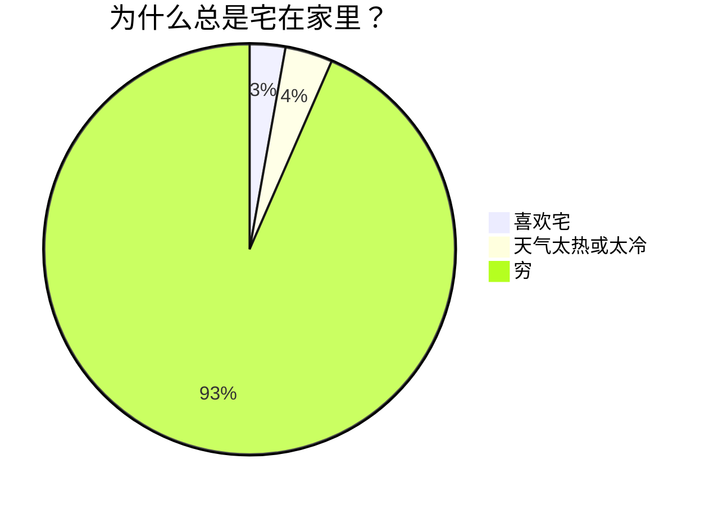

# Getting Started

## Header
这是一个`金色`秋天

一级标题

|商品|数量|单价|
|-|-------:|:------:|
|苹果|10|\$1|
|电脑|1|\$1000|


> This is a blockquote with two paragraphs. Lorem ipsum dolor sit amet,
> consectetuer adipiscing elit. Aliquam hendrerit mi posuere lectus.
> Vestibulum enim wisi, viverra nec, fringilla in, laoreet vitae, risus.
>
> Donec sit amet nisl. Aliquam semper ipsum sit amet velit. Suspendisse
> id sem consectetuer libero luctus adipiscing.


- 文本1
- 文本2
- 文本3

*   A list item with a blockquote:

    > This is a blockquote
    > inside a list item.

```javascript  
function a () {
    const b = '123'
}
```

> This is a blockquote with two paragraphs. Lorem ipsum dolor sit amet,
> consectetuer adipiscing elit. Aliquam hendrerit mi posuere lectus.
> Vestibulum enim wisi, viverra nec, fringilla in, laoreet vitae, risus.
>
> Donec sit amet nisl. Aliquam semper ipsum sit amet velit. Suspendisse
> id sem consectetuer libero luctus adipiscing.


> This is a blockquote with two paragraphs. Lorem ipsum dolor sit amet,
> consectetuer adipiscing elit. Aliquam hendrerit mi posuere lectus.
> Vestibulum enim wisi, viverra nec, fringilla in, laoreet vitae, risus.
>
> Donec sit amet nisl. Aliquam semper ipsum sit amet velit. Suspendisse
> id sem consectetuer libero luctus adipiscing.


